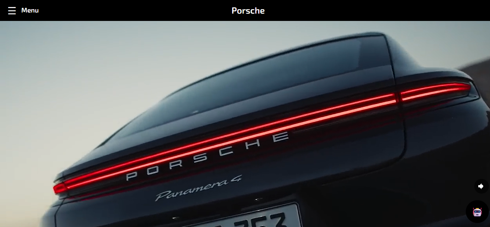

# Porsche AI Chatbot

Integrated an AI-powered chatbot into a Porsche-themed website clone to enhance user interaction and automate responses to common queries. This simulates a virtual assistant, providing instant support and showcasing conversational AI features within a sleek, automotive styled frontend.

**Live Website:** [https://kethnulee-weerasinghe.github.io/Porsche-AI-ChatBot/](https://kethnulee-weerasinghe.github.io/Porsche-AI-ChatBot/)



## Overview

This portfolio site is designed to present a clear, concise view of my professional profile. It includes:

- Project highlights with GitHub links
- Downloadable resume
- Timeline-based education section
- Categorized technical skill set
- Responsive layout for desktop, tablet, and mobile
- Contact form

## Technologies

- HTML
- CSS
- JavaScript
- React
- Web3Forms (contact form handling)

## Running Locally

To view or edit the project locally:

```bash
git clone https://github.com/Kethnulee-Weerasinghe/Porsche-AI-Chatbot.git
cd Porsche AI Chatbot
